# DATABASE_PENGELOLAAN_SURAT_MASUK_DAN_KELUAR

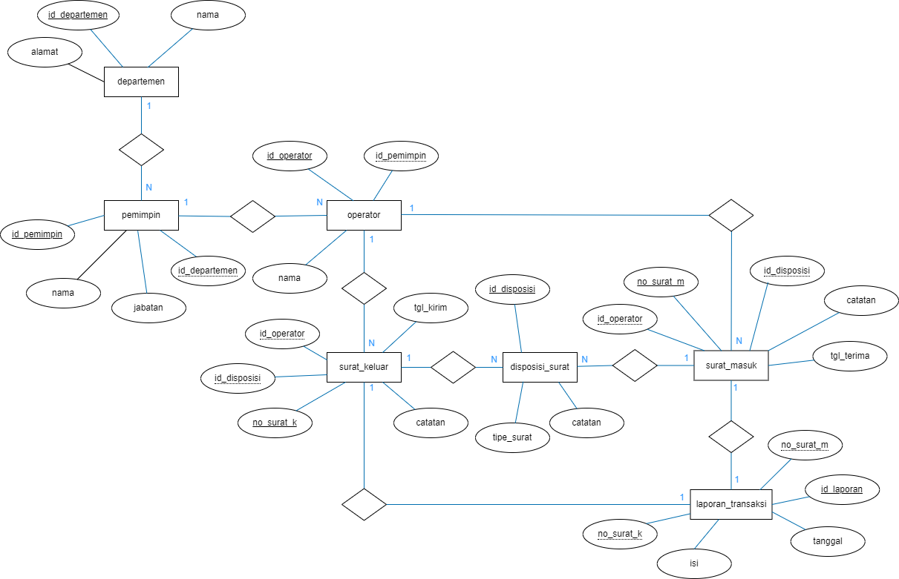<br>

## **ER-D** 
  - ER-D (Entity-Relationship Diagram) adalah sebuah model yang digunakan untuk memvisualisasikan hubungan antara entitas dalam sebuah sistem atau basis data. Berikut adalah penjelasan ER-D yang berisi entitas dan atribut-atribut yang disebutkan:

Entitas "Pemimpin":
-	id_pemimpin (atribut): ID unik untuk setiap pemimpin.
-	id_departemen (atribut): ID departemen yang dipimpin oleh pimpinan.
-	nama (atribut): Nama pemimpin.
-	jabatan (atribut): pemimpin Jabatan.

Entitas "Operator":
-	id_operator (atribut): ID unik untuk setiap operator.
-	id_pemimpin (atribut): Pemimpin ID yang mengawasi operator.
-	nama (atribut): Nama operator.

Entitas "Departemen":
-	id_departemen (atribut): ID unik untuk setiap departemen.
-	nama (atribut): Nama departemen.
-	alamat (atribut): Alamat departemen.

Entitas "Surat Masuk":
-	no_surat_masuk (atribut): Nomor surat masuk.
-	id_operator (atribut): ID operator yang menerima surat masuk.
-	id_disposisi (atribut): ID disposisi yang diberikan pada surat masuk.
-	tgl_terima (atribut): Tanggal surat diterima.
-	catatan (atribut): Catatan terkait surat masuk.

Entitas "Disposisi":
-	id_disposisi (atribut): ID unik untuk setiap disposisi.
-	tipe_surat (atribut): Tipe surat yang terdisposisi.
-	catatan (atribut): Catatan terkait disposisi.
-	Entitas "Surat Keluar":
-	no_surat_k (atribut): Nomor surat keluar.
-	id_operator (atribut): ID operator yang mengirim surat keluar.
-	id_disposisi (atribut): ID disposisi yang terkait dengan surat keluar.
-	tgl_kirim (atribut): Tanggal surat dikirim.
-	catatan (atribut): Catatan terkait surat keluar.

Entitas "Laporan Transaksi":
-	id_laporan (atribut): ID unik untuk setiap laporan transaksi.
-	no_surat_m (atribut): Nomor surat masuk yang terkait.
-	no_surat_k (atribut): Nomor surat keluar yang terkait.
-	tanggal (atribut): Tanggal laporan transaksi dibuat.
-	isi (atribut): Isi dari laporan transaksi.

Dalam ER-D ini, terdapat beberapa hubungan antara entitas:

1.	Hubungan antara Pemimpin dan Operator:
Pemimpin (id_pemimpin) memiliki hubungan "memiliki" dengan Operator (id_pemimpin).

2.	Hubungan antara Operator dan Departemen:
Operator (id_departemen) memiliki hubungan "tergabung dalam" dengan Departemen (id_departemen).

3.	Hubungan antara Surat Masuk dan Operator:
Surat Masuk (id_operator) memiliki hubungan "diterima oleh" dengan Operator (id_operator).

4.	Hubungan antara Surat Masuk dan Disposisi:
Surat Masuk (id_disposisi) memiliki hubungan "memiliki" dengan Disposisi (id_disposisi).

5.	Hubungan antara Surat Keluar dan Operator:
Surat Keluar (id_operator) memiliki hubungan "dikirim oleh" dengan Operator (id_operator).

6.	Hubungan antara Surat Keluar dan Disposisi:
Surat Keluar (id_disposisi) memiliki hubungan "memiliki" dengan Disposisi (id_disposisi).

7.	Hubungan antara Laporan Transaksi, Surat Masuk, dan Surat Keluar:
Laporan Transaksi (no_surat_m) memiliki hubungan "terkait dengan" Surat Masuk (no_surat_masuk).
Laporan Transaksi (no_surat_k) memiliki hubungan "terkait dengan" Surat Keluar (no_surat_k).

Dengan adanya hubungan-hubungan ini, kita dapat merepresentasikan bagaimana entitas-entitas dalam sistem yang saling terkait dan berinteraksi satu sama lain dalam ER-D

-- Membuat tabel Pemimpin
CREATE TABLE Pemimpin (
id_pemimpin INT PRIMARY KEY,
id_departemen INT,
nama VARCHAR(255),
jabatan VARCHAR(255),
FOREIGN KEY (id_departemen) REFERENCES Departemen(id_departemen)
);
## **DDL(Data Definition Lenguge)**

  - DDL (Data Definition Language) adalah kumpulan perintah atau kata sandi dalam bahasa pemrograman yang digunakan untuk mendefinisikan struktur atau skema basis data. DDL digunakan untuk membuat, mengubah, atau menghapus objek-objek dalam basis data, seperti tabel, kolom, indeks, dan kendala.

1. Tabel "Pemimpin":
- id_pemimpin: Kolom dengan tipe data INT sebagai primary key yang menyimpan ID unik untuk setiap pemimpin.
id_departemen: Kolom dengan tipe data INT yang menyimpan ID departemen yang dipimpin oleh pimpinan.
nama: Kolom dengan tipe data VARCHAR(255) yang menyimpan nama pemimpin.
postingan: Kolom dengan tipe data VARCHAR(255) yang menyimpan jabatan pemimpin.<br>
```sql
CREATE TABLE Pemimpin (
id_pemimpin INT PRIMARY KEY,
id_departemen INT,
nama VARCHAR(255),
jabatan VARCHAR(255),
FOREIGN KEY (id_departemen) REFERENCES Departemen(id_departemen)
);
```
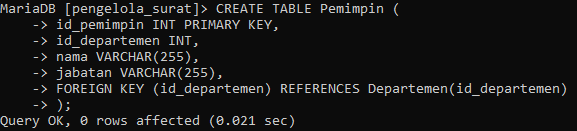<br>

2. Tabel "Operator":
- id_operator: Kolom dengan tipe data INT sebagai primary key yang menyimpan ID unik untuk setiap operator.
id_pemimpin: Kolom dengan tipe data INT yang menyimpan ID pemimpin yang mengawasi operator.
nama: Kolom dengan tipe data VARCHAR(255) yang menyimpan nama operator.
```sql
CREATE TABLE Operator (
id_operator INT PRIMARY KEY,
id_pemimpin INT,
nama VARCHAR(255),
FOREIGN KEY (id_pemimpin) REFERENCES Pemimpin(id_pemimpin)
);
```
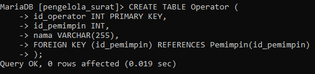<br>

3. Tabel "Departemen":
- id_departemen: Kolom dengan tipe data INT sebagai primary key yang menyimpan ID unik untuk setiap departemen.
nama: Kolom dengan tipe data VARCHAR(255) yang menyimpan nama departemen.
alamat: Kolom dengan tipe data VARCHAR(255) yang menyimpan alamat departemen.
```sql
CREATE TABLE Departemen (
id_departemen INT PRIMARY KEY,
nama VARCHAR(255),
alamat VARCHAR(255)
);
```
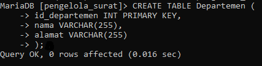<br>

4. Tabel "Surat Masuk":
- no_surat_masuk: Kolom dengan tipe data INT sebagai primary key yang menyimpan nomor surat masuk.
id_operator: Kolom dengan tipe data INT yang menyimpan ID operator yang menerima surat masuk.
id_disposisi: Kolom dengan tipe data INT yang menyimpan ID disposisi yang diberikan pada surat masuk.
tgl_terima: Kolom dengan tipe data DATE yang menyimpan tanggal surat diterima.
catatan: Kolom dengan tipe data TEXT yang menyimpan catatan terkait surat masuk.
```sql
CREATE TABLE SuratMasuk (
no_surat_masuk INT PRIMARY KEY,
id_operator INT,
id_disposisi INT,
tgl_terima DATE,
catatan TEXT,
FOREIGN KEY (id_operator) REFERENCES Operator(id_operator),
FOREIGN KEY (id_disposisi) REFERENCES Disposisi(id_disposisi)
);
```
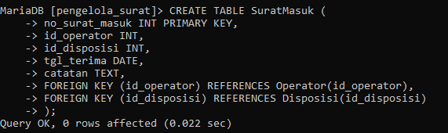<br>

5. Tabel "Disposisi":
- id_disposisi: Kolom dengan tipe data INT sebagai primary key yang menyimpan ID unik untuk setiap disposisi.
tipe_surat: Kolom dengan tipe data VARCHAR(255) yang menyimpan tipe surat yang terdisposisi.
catatan: Kolom dengan tipe data TEXT yang menyimpan catatan terkait disposisi.
```sql
CREATE TABLE Disposisi (
id_disposisi INT PRIMARY KEY,
tipe_surat VARCHAR(255),
catatan TEXT
);
```
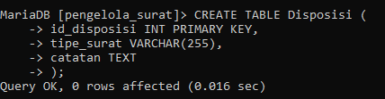<br>

6. Tabel "Surat Keluar":
- no_surat_k: Kolom dengan tipe data INT sebagai primary key yang menyimpan nomor surat keluar.
id_operator: Kolom dengan tipe data INT yang menyimpan ID operator yang mengirim surat keluar.
id_disposisi: Kolom dengan tipe data INT yang menyimpan ID disposisi yang diberikan pada surat keluar.
tgl_kirim: Kolom dengan tipe data DATE yang menyimpan tanggal surat terkirim.
catatan: Kolom dengan tipe data TEXT yang menyimpan catatan terkait surat keluar.
```sql
CREATE TABLE SuratKeluar (
no_surat_k INT PRIMARY KEY,
id_operator INT,
id_disposisi INT,
tgl_kirim DATE,
catatan TEXT,
FOREIGN KEY (id_operator) REFERENCES Operator(id_operator),
FOREIGN KEY (id_disposisi) REFERENCES Disposisi(id_disposisi)
);
```
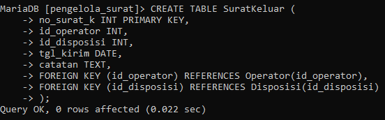<br>

7. Tabel "Laporan Transaksi":
- id_laporan: Kolom dengan tipe data INT sebagai primary key yang menyimpan ID unik untuk setiap laporan transaksi.
no_surat_m: Kolom dengan tipe data INT yang menyimpan nomor surat masuk terkait laporan transaksi.
no_surat_k: Kolom dengan tipe data INT yang menyimpan nomor surat keluar terkait laporan transaksi.
tanggal: Kolom dengan tipe data DATE yang menyimpan tanggal laporan transaksi.
isi: Kolom dengan tipe data TEXT yang menyimpan isi laporan transaksi.
```sql
CREATE TABLE LaporanTransaksi (
id_laporan INT PRIMARY KEY,
no_surat_m INT,
no_surat_k INT,
tanggal DATE,
isi TEXT,
FOREIGN KEY (no_surat_m) REFERENCES SuratMasuk(no_surat_masuk),
FOREIGN KEY (no_surat_k) REFERENCES SuratKeluar(no_surat_k)
);
```
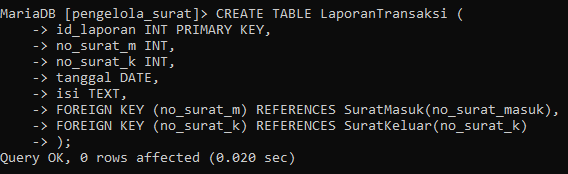<br>

## **CRUD (CREATE - READ - UPDATE - DELETE)**
- CRUD adalah singkatan dari Create, Read, Update, dan Delete. Ini adalah empat operasi dasar yang digunakan dalam pengelolaan data dalam basis data atau sistem informasi.
  1. Create (Buat): Operasi Create digunakan untuk membuat atau menambahkan data baru ke dalam basis data. Ini melibatkan pembuatan catatan baru dengan nilai-nilai yang ditentukan untuk setiap kolom yang relevan dalam tabel yang sesuai.<br>
  Contoh:
  ```sql
  INSERT INTO TableName (column1, column2, ...)
  VALUES (value1, value2, ...);
  ```

  - Isian tabel pemimpin
  ```sql
  INSERT INTO pemimpin VALUES
  (5987,201,'Budi','Direktur'),
  (1507,202,'Ani','Manager'),
  (1928,203,'Rudi','Supervisor');
  ```
  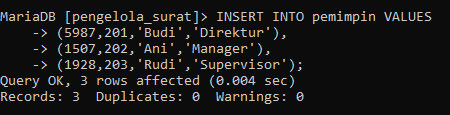<br>
  
  - Isian tabel operator
  ```sql  
  INSERT INTO operator VALUES
  (001,5987,'Dina'),
  (002,1507,'Eko'),
  (003,1928,'Fani');
  ```
  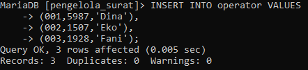<br>
  
  - Isian tabel departemen
  ```sql
  INSERT INTO departemen VALUES
  (201,'Keuangan','Jl. Merdeka No.1'),
  (202,'Pemasaran','Jl. Sudirman No.2'),
  (203,'Produksi','Jl. Industri No.3');
  ```
  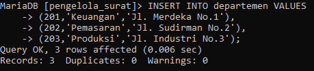<br>

  - Isian tabel disposisi
  ```sql
  INSERT INTO disposisi VALUES
  (123,'Undangan','Hadir pada acara peresmian gedung baru'),
  (234,'Pengumuman','Menyampaikan informasi terbaru tentang produk'),
  (345,'Permintaan','Mengirimkan data penjualan bulan lalu');
  ```
  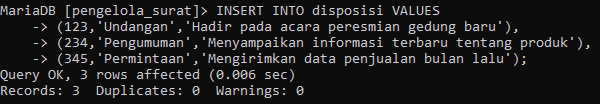<br>

  - Isian tabel SuratMasuk
  ```sql
  INSERT INTO SuratMasuk VALUES
  (10751,001,123,'2023-06-25','Surat undangan dari PT Maju Jaya'),
  (10234,002,234,'2023-06-26','Surat pengumuman dari PT Berkah Abadi'),
  (10892,003,345,'2023-06-27','Surat permintaan dari PT Sejahtera Makmur');
  ```
  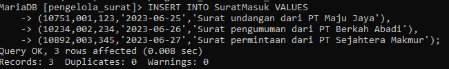<br>
  
  - Isian tabel SuratKeluar
  ```sql
  INSERT INTO SuratKeluar VALUES
  (15701,001,123,'2023-06-28','Surat konfirmasi kehadiran ke PT Maju Jaya'),
  (43201,002,234,'2023-06-29','Surat balasan pengumuman ke PT Berkah Abadi'),
  (29801,003,345,'2023-06-30','Surat pengiriman data penjualan ke PT Sejahtera Makmur');
  ```
  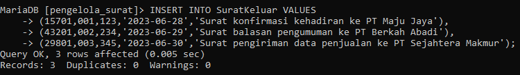<br>

  - Isian tabel LaporanTransaksi
  ```sql
  INSERT INTO LaporanTransaksi VALUES
  (5479,10751,15701,'2023-06-28','Laporan transaksi antara PT Maju Jaya dan PT Keuangan'),
  (8156,10234,43201,'2023-06-29','Laporan transaksi antara PT Berkah Abadi dan PT Pemasaran'),
  (9239,10892,29801,'2023-06-30','Laporan transaksi antara PT Sejahtera Makmur dan PT Produksi');
  ```
  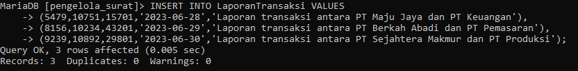<br>
  
  2. Read (Baca): Operasi Read digunakan untuk membaca atau mengambil data yang ada dari basis data. Ini melibatkan pemilihan dan pengambilan data yang relevan dari tabel berdasarkan kriteria tertentu.<br>
  Contoh:
  ```sql
  SELECT column1, column2, ...
  FROM TableName
  WHERE condition;
  ```
  3. Update (Perbarui): Operasi Update digunakan untuk memperbarui data yang sudah ada dalam basis data. Ini melibatkan perubahan nilai-nilai dalam satu atau lebih kolom dalam tabel yang sesuai.<br>
  Contoh:
  ```sql
  UPDATE TableName
  SET column1 = value1, column2 = value2, ...
  WHERE condition;
  ```
 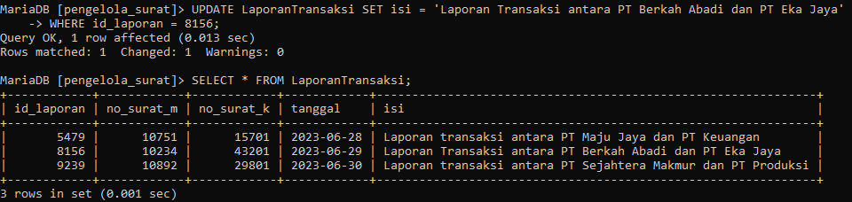<br>


  4. Delete (Hapus): Operasi Delete digunakan untuk menghapus data yang ada dari basis data. Ini melibatkan penghapusan catatan atau baris tertentu dari tabel berdasarkan kriteria tertentu.<br>
  Contoh:
  ```sql
  DELETE FROM TableName
  WHERE condition;
  ```
 
## **JOIN**
- JOIN dalam SQL digunakan untuk menggabungkan baris-baris dari dua atau lebih tabel berdasarkan kriteria yang ditentukan. Hal ini memungkinkan pengguna untuk mengakses dan memanipulasi data yang terkait antara tabel-tabel tersebut.

  - GABUNG antara tabel "Pemimpin" dan "Departemen" berdasarkan kolom "id_departemen":
  ```sql
  SELECT p.id_pemimpin, p.nama, p.jabatan, d.nama AS nama_departemen
  FROM pemimpin p
  JOIN departemen d ON p.id_departemen = d.id_departemen;
  ```
  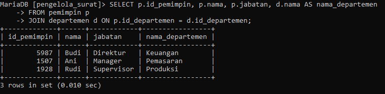<br>
  
  - JOIN antara tabel "Operator", "Pemimpin", dan "Departemen" berdasarkan kolom "id_pemimpin":
  ```sql
  SELECT o.id_operator, o.nama AS nama_operator, p.nama AS nama_pemimpin, d.nama AS nama_departemen
  FROM operator o
  JOIN pemimpin p ON o.id_pemimpin = p.id_pemimpin
  JOIN departemen d ON p.id_departemen = d.id_departemen;
  ```
  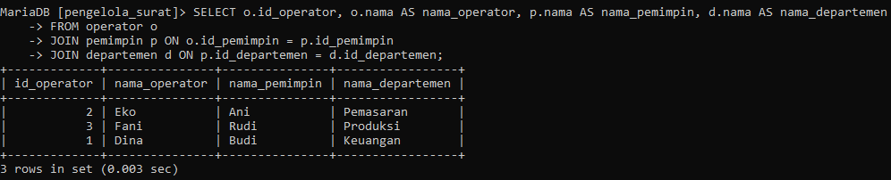<br>
  
  - GABUNG antara tabel "SuratMasuk", "Operator", dan "Disposisi" berdasarkan kolom "id_operator" dan "id_disposisi":
  ```sql
  SELECT sm.no_surat_masuk, sm.tgl_terima, sm.catatan, o.nama AS nama_operator, d.tipe_surat, d.catatan AS catatan_disposisi
  FROM SuratMasuk sm
  JOIN operator o ON sm.id_operator = o.id_operator
  JOIN disposisi d ON sm.id_disposisi = d.id_disposisi;
  ```
  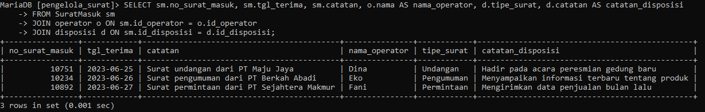<br>
  
  - GABUNG antara tabel "SuratKeluar", "Operator", dan "Disposisi" berdasarkan kolom "id_operator" dan "id_disposisi":
  ```sql
  SELECT sk.no_surat_k, sk.tgl_kirim, sk.catatan, o.nama AS nama_operator, d.tipe_surat, d.catatan AS catatan_disposisi
  FROM SuratKeluar sk
  JOIN operator o ON sk.id_operator = o.id_operator
  JOIN disposisi d ON sk.id_disposisi = d.id_disposisi;
  ```
  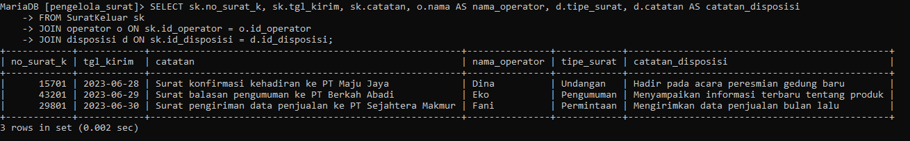<br>
  
  - GABUNG antara tabel "LaporanTransaksi", "SuratMasuk", dan "SuratKeluar" berdasarkan kolom "no_surat_m" dan "no_surat_k":
  ```sql
  SELECT lt.id_laporan, lt.tanggal, lt.isi, sm.no_surat_masuk, sk.no_surat_k
  FROM LaporanTransaksi lt
  JOIN SuratMasuk sm ON lt.no_surat_m = sm.no_surat_masuk
  JOIN SuratKeluar sk ON lt.no_surat_k = sk.no_surat_k;
  ```
  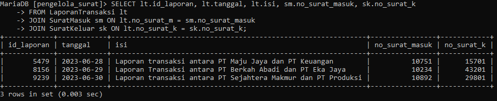<br>

  
